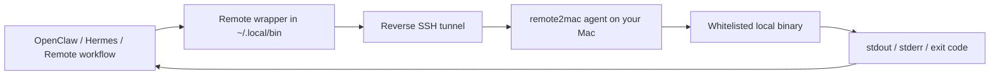

[中文 README](./README.zh-CN.md)

# remote2mac

`remote2mac` is a lightweight bridge for macOS that lets software running on a cloud VM, VPS, or server call a small whitelist of binaries on your local Mac through a reverse SSH tunnel.

It is especially useful when services such as OpenClaw or Hermes are deployed remotely but still need to invoke local macOS-only tools, scripts, or commands on demand.

## Architecture



## Demo

Example: a remote service calls local `remindctl` on your Mac.

Remote side:

```bash
remindctl
```

Example output:

```text
[1] [ ] Review OpenClaw logs [Ops] — Apr 18, 2026 09:00
[2] [ ] Prepare Hermes prompt set [Research] — Apr 19, 2026 14:30
[3] [ ] Renew Apple Developer certificate [Admin] — Apr 21, 2026
[4] [ ] Check local automation health [Maintenance] — Apr 22, 2026 20:00
```

The command is invoked remotely, but the actual binary runs on your local Mac.

## Features

- Runs a local FastAPI agent bound to `127.0.0.1`
- Maintains an `ssh -R` reverse tunnel from your Mac to the remote machine
- Only executes explicitly whitelisted local binaries
- Installs one remote dispatcher plus same-name wrappers in the remote bin directory
- Includes `init`, `doctor`, `bootstrap`, and `agent` CLI commands

## How It Works

1. `remote2mac agent` starts the local HTTP service and keeps the reverse SSH tunnel alive.
2. `remote2mac bootstrap` installs wrappers on the remote server, usually under `~/.local/bin`.
3. A remote wrapper forwards the request back to your Mac through the tunnel.
4. The local agent executes the mapped binary with `shell=False` and returns stdout, stderr, exit code, and timing metadata.

## Install

```bash
uv sync
```

Or:

```bash
pip install -e .
```

## Quick Start

Generate a starter config:

```bash
remote2mac init
```

Edit `~/.config/remote2mac/config.toml`:

```toml
[local]
listen_host = "127.0.0.1"
listen_port = 18123

[remote]
ssh_host = "your-remote-server"
ssh_user = "your-remote-user"
ssh_port = 22
remote_forward_port = 48123
remote_bin_dir = "~/.local/bin"

[tools.remindctl]
path = "/opt/homebrew/bin/remindctl"
timeout_sec = 30
max_output_bytes = 1048576
```

Check prerequisites and install the remote wrappers:

```bash
remote2mac doctor
remote2mac bootstrap
remote2mac agent
```

## CLI

```bash
remote2mac init --config /path/to/config.toml
remote2mac doctor --config /path/to/config.toml
remote2mac bootstrap --config /path/to/config.toml
remote2mac agent --config /path/to/config.toml
```

## Example Use Cases

- OpenClaw runs on a VPS but needs to trigger a binary that only exists on your Mac
- Hermes runs in the cloud and needs a safe way to call a local script or command
- A remote workflow needs occasional access to macOS-native tooling without exposing your full machine as a shell

## launchd

A sample plist is included:

- `launchd/io.remote2mac.agent.plist`

Replace the username, project path, and config path, then load it with `launchd` if you want the agent to start automatically on boot.

## Limitations

- Whitelist only; no arbitrary shell execution
- Listens on loopback only
- No stdin, interactive TTY, or long-lived sessions
- Output is capped per tool and commands can time out

## Security Notes

- The API requires an in-memory session token
- The remote side can only call tool names declared in the config
- All configured tool paths must be absolute local paths

## License

Apache-2.0
