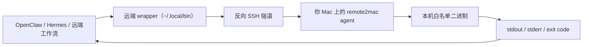

[English README](./README.md)

# remote2mac

`remote2mac` 是一个面向 macOS 的轻量桥接工具，可以让部署在云端、VPS 或服务器上的程序，通过反向 SSH 隧道调用你本机 Mac 上白名单内的二进制文件或命令。

它尤其适合这样的场景：OpenClaw 或 Hermes 部署在远端，但仍然需要按需触发你本地 macOS 上才有的工具、脚本或命令。

## 架构图



## Demo

示例：远端服务调用你 Mac 上本地安装的 `remindctl`。

远端执行：

```bash
remindctl
```

示例输出：

```text
[1] [ ] 复盘 OpenClaw 日志 [运维] — 2026年4月18日 09:00
[2] [ ] 整理 Hermes 提示词 [科研] — 2026年4月19日 14:30
[3] [ ] 更新 Apple Developer 证书 [管理] — 2026年4月21日
[4] [ ] 检查本地自动化健康状态 [维护] — 2026年4月22日 20:00
```

命令是在远端触发的，但实际执行的二进制仍然在你的本机 Mac 上。

## 功能特性

- 在本机启动一个绑定到 `127.0.0.1` 的 FastAPI agent
- 自动维护从 Mac 到远端机器的 `ssh -R` 反向隧道
- 只执行配置文件中显式声明的白名单工具
- 在远端安装一个 dispatcher 和若干同名 wrapper
- 提供 `init`、`doctor`、`bootstrap`、`agent` 等 CLI 命令

## 工作原理

1. `remote2mac agent` 在本机启动 HTTP 服务，并持续维护反向 SSH 隧道。
2. `remote2mac bootstrap` 会在远端服务器上安装 wrapper，默认通常放在 `~/.local/bin`。
3. 远端执行 wrapper 时，请求会通过隧道回传到你的 Mac。
4. 本地 agent 以 `shell=False` 的方式执行映射后的二进制，并返回 stdout、stderr、退出码和耗时信息。

## 安装

```bash
uv sync
```

或者：

```bash
pip install -e .
```

## 快速开始

先生成一份初始配置：

```bash
remote2mac init
```

然后编辑 `~/.config/remote2mac/config.toml`：

```toml
[local]
listen_host = "127.0.0.1"
listen_port = 18123

[remote]
ssh_host = "your-remote-server"
ssh_user = "your-remote-user"
ssh_port = 22
remote_forward_port = 48123
remote_bin_dir = "~/.local/bin"

[tools.remindctl]
path = "/opt/homebrew/bin/remindctl"
timeout_sec = 30
max_output_bytes = 1048576
```

检查环境并安装远端 wrapper：

```bash
remote2mac doctor
remote2mac bootstrap
remote2mac agent
```

## CLI

```bash
remote2mac init --config /path/to/config.toml
remote2mac doctor --config /path/to/config.toml
remote2mac bootstrap --config /path/to/config.toml
remote2mac agent --config /path/to/config.toml
```

## 适用场景

- OpenClaw 部署在 VPS 上，但需要调用只存在于本机 Mac 的二进制程序
- Hermes 运行在云端，需要安全地触发本地脚本或命令
- 远端工作流偶尔需要用到 macOS 原生工具，但又不希望暴露整台机器的 shell 能力

## launchd

仓库内提供了一个示例 plist：

- `launchd/io.remote2mac.agent.plist`

将其中的用户名、项目路径和配置路径替换为你的实际值后，可以通过 `launchd` 实现开机自启。

## 限制

- 仅支持白名单工具，不支持任意 shell 执行
- 只监听本地回环地址
- 不支持 stdin、交互式 TTY 或长期会话
- 每个工具的输出大小和执行时间都有限制

## 安全说明

- API 依赖内存中的会话 token 进行鉴权
- 远端只能调用配置里声明过的工具名
- 所有工具路径都必须是本机绝对路径

## License

Apache-2.0
